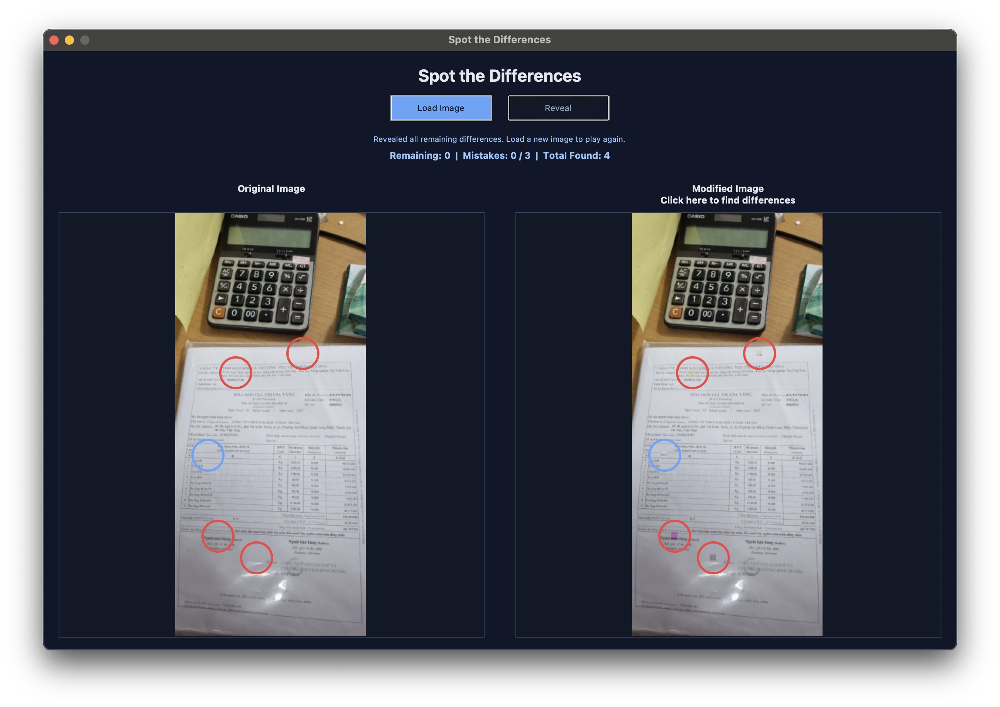

# Spot the Differences

A Tkinter-based desktop game developed for **HIT137 Assignment 3**. The player loads an image, and the application programmatically generates a modified copy containing exactly five hidden differences. The player must inspect the the modified image and click on it to find the differences.

## Preview


## How to Run

### Install the required packages:

Windows:
```bash
pip install -r requirements.txt
```

MacOS/Linux:
```bash
pip3 install -r requirements.txt
```

### Run the program:

Windows:
```bash
py Spot_the_Differences.py
```

MacOS/Linux:
```bash
python3 Spot_the_Differences.py
```

## Features

- Loads JPG, JPEG, PNG, and BMP images.
- Displays the original and modified images side by side.
- Creates exactly five random non-overlapping differences.
- Uses four OpenCV alteration types: color shift, blur, brightness change, and patch copy.
- Tracks remaining differences, mistakes, and total found differences.
- Allows three mistakes per image before locking the round.
- Draws red circles for found differences and blue circles when revealing answers.

## OOP Design

- `Difference` is the parent class for all difference types.
- `ColorShiftDifference`, `BlurDifference`, `BrightnessDifference`, and `PatchCopyDifference` inherit from `Difference` and override `apply()`.
- `ImageProcessor` handles loading, resizing, and generating differences.
- `GameState` tracks mistakes, remaining differences, locking, and total found differences.
- `SpotTheDifferenceApp` builds the Tkinter interface and handles user actions.

## Group Assignment DAN/EXT 28 - Name - Student Number

- Thi Kim Anh Bui - S401484
- Ngoc Ngan Le - S401010
- Usha Lamsal - S401809
- Sandesh Paudel Paudel - S404558